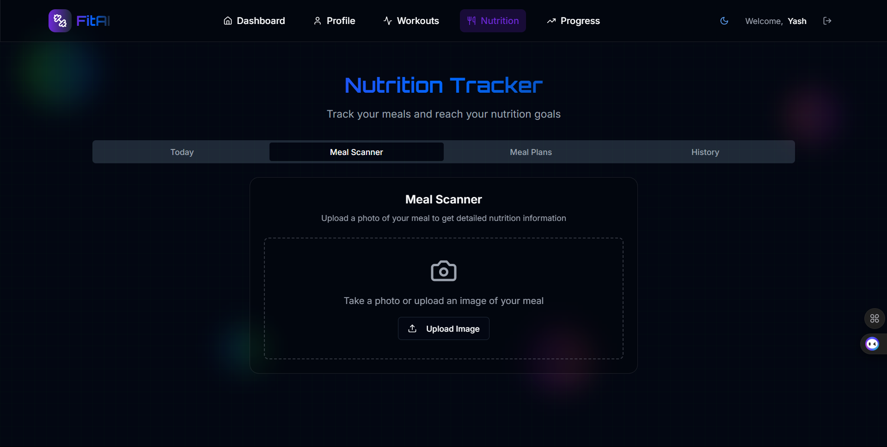
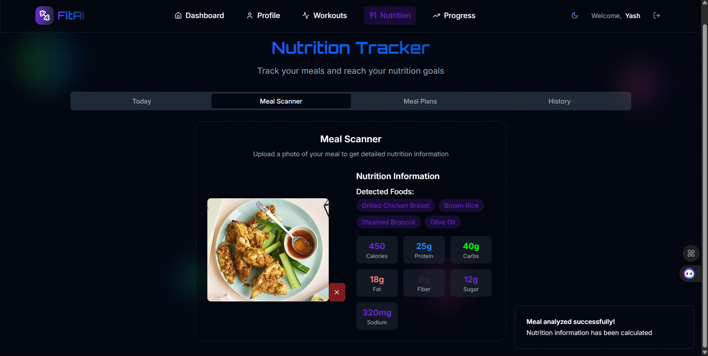
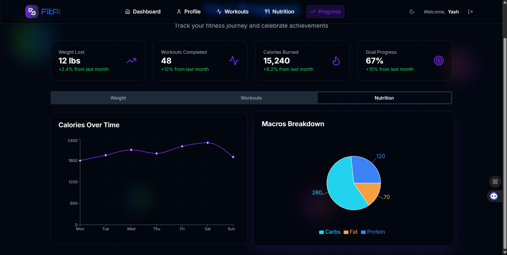

# FitCoach_AI

FitCoach_AI is a smart AI-powered fitness and nutrition assistant that helps users achieve their health goals through personalized workout plans and diet suggestions. It features food image recognition using Roboflow to provide real-time nutrition insights and tailored recommendations.

---

## 🚀 Features

- 🎯 **AI-Personalized Fitness Coaching**
  - Suggests exercises based on your fitness goals (e.g., weight loss, muscle gain).
  
- 🥗 **Smart Diet Plans Based on Food Image Analysis**
  - Tailors meal plans depending on the food detected.

- 📸 **Food Detection via Roboflow API**
  - Upload a food image to detect ingredients and get nutritional insights.

- 📊 **Goal-based Suggestions**
  - Adjusts recommendations dynamically based on user input and detections.

- 🔐 **Expandable for Authentication, Progress Tracking, and Analytics**

---

## 🧰 Tech Stack

| Component   | Technology                      |
|------------|----------------------------------|
| Frontend   | HTML, CSS, JavaScript            |
| Backend    | Node.js *(assumed implemented)*  |
| API        | Roboflow Image Detection API     |
| Deployment | Vercel / Netlify *(optional)*    |

---

## 📸 Screenshots

### 🔹 Home / Dashboard

### 🔹 Food Upload Interface

### 🔹 Food Detection Output

### 🔹 Diet & Fitness Recommendations

> 📂 Make sure to place these screenshots in a `screenshots` folder inside your project directory.

---

## 🔌 Roboflow Integration

- Food image is captured or uploaded by the user.
- The app sends the image to Roboflow’s API for processing.
- The API returns detected food items with confidence scores.
- The app uses this to generate real-time meal insights and suggest compatible workouts and calorie goals.

---

🚧 Future Enhancements
✅ User login and profile history

✅ Progress tracking (weekly/monthly)

🔜 Integration with wearables

🔜 Voice assistant & chatbot support
